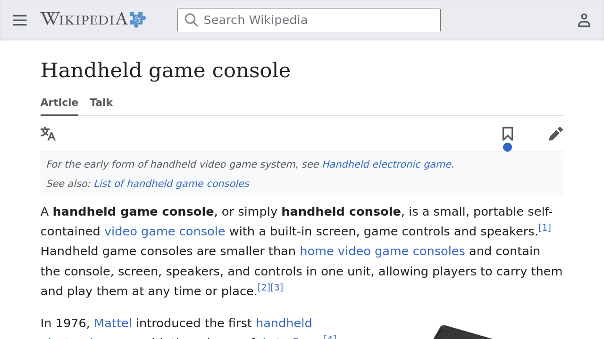
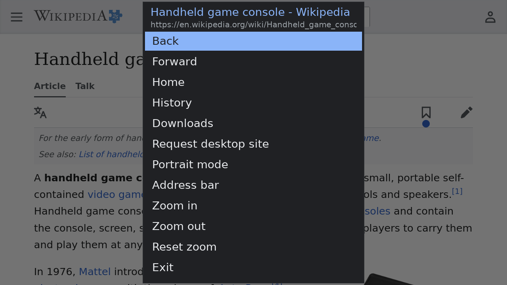
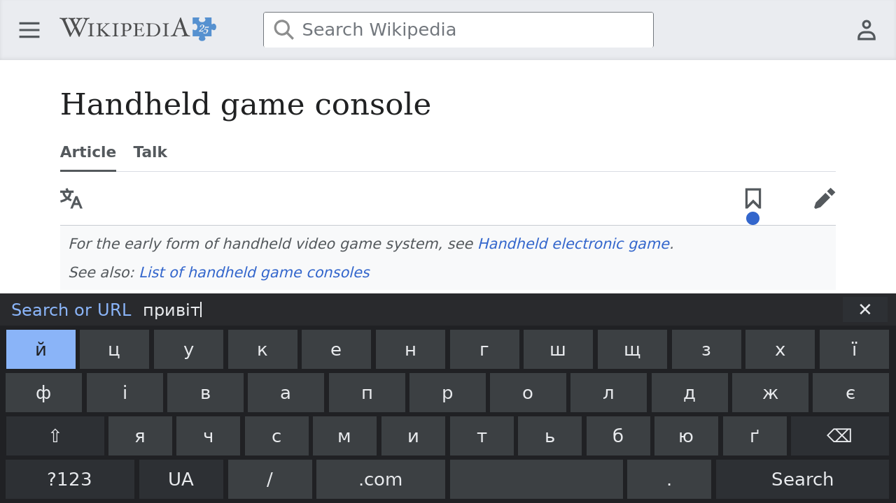
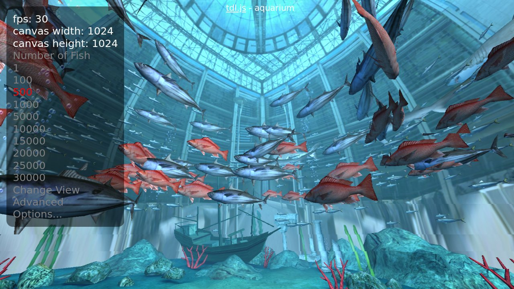
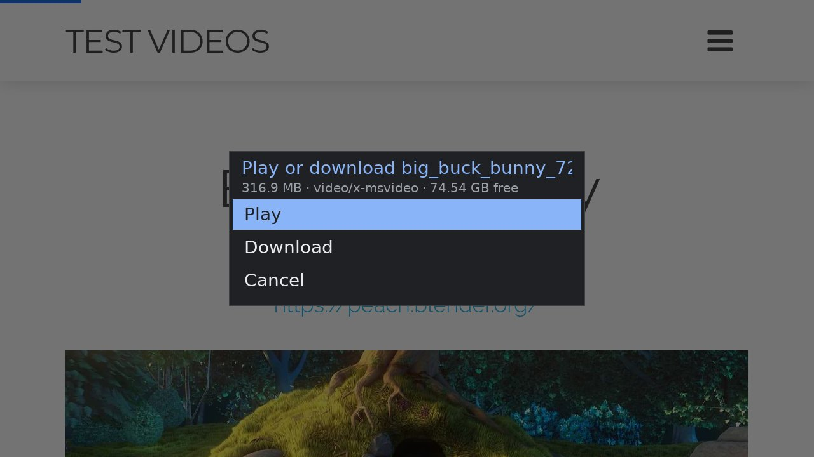
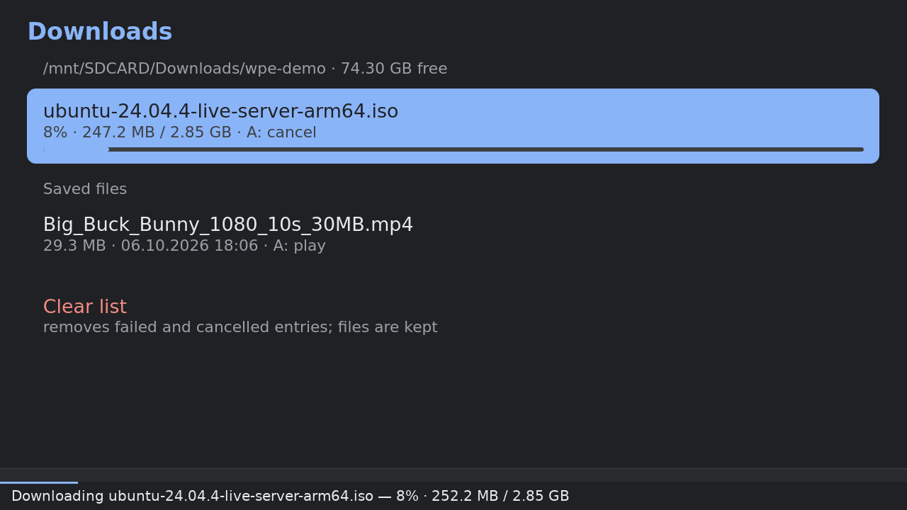
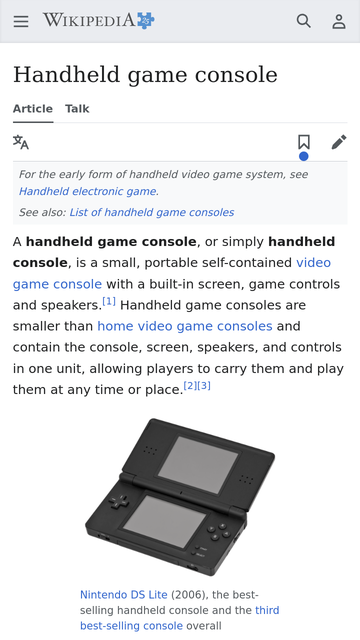
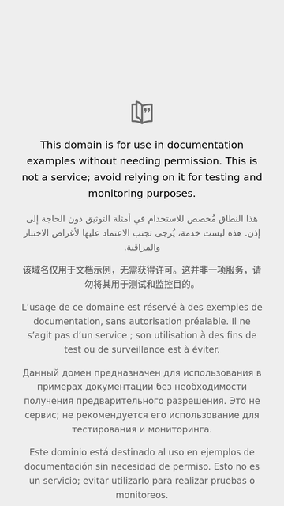

# WPE Browser for TrimUI Smart Pro

A real web browser for the **TrimUI Smart Pro** handheld, built on [WPE WebKit](https://wpewebkit.org/)
2.54, the engine family behind Safari. It's tuned for the device's 1 GB of RAM and PowerVR GPU, and
you drive it with the gamepad, a USB keyboard and mouse, or the on-screen keyboard.

| | |
|---|---|
|  |  |
|  |  |
|  |  |
|  |  |
|  |  |

## ✨ Features

- 🚀 **GPU accelerated**: pages are rendered on the PowerVR GE8300 and handed to the screen without
  copying (zero-copy frames): ~60 fps scrolling instead of 25.
- 🧠 **Made for 1 GB of RAM**: one page process, memory limits and a low-memory watchdog keep the device
  responsive; the mobile site versions it asks for are much lighter.
- 📺 **YouTube in hardware-accelerated mpv**: video pages play in the bundled mpv with the Allwinner
  H.264 hardware decoder (720p at ~14% CPU). The page stays open for comments and likes, with a
  **▶ Play in mpv** button to watch again. Embedded YouTube players and `<video>`/`<audio>` on any site
  play the same way.
- 🔄 **yt-dlp updates itself**: the browser checks for new releases daily and installs them after a
  checksum check, so YouTube keeps working.
- 🛡️ **Ad and tracker blocking**: EasyList + EasyPrivacy (~94,000 rules) built into WebKit, pages load
  faster and use far less memory.
- 🎮 **Gamepad-first**: analog pointer, smooth scrolling, and an Android-style on-screen keyboard.
- ⌨️🖱️ **USB keyboard and mouse**: plug and play, with shortcuts and layout switching.
- 🌍 **Any keyboard layout**: all XKB layouts (Ukrainian, German, French, Dvorak…) for both keyboards,
  switched with one key.
- 🧊 **WebGL**: 3D in pages on the GPU; the WebGL Aquarium sample runs at 30 fps with 500 fish.
- 📱 **Portrait mode**: turn the device sideways for long articles and feeds, like mpv does for portrait
  videos.
- ⬇️ **Downloads**: save files, links and page media to the SD card, and play videos and audios from there.
- 🕘 **History, home page, search**: start on your home page, the last page or the address bar; anything
  that isn't a URL is searched.
- 🍪 **Stays logged in**: cookies and site storage are kept across restarts.
- 📦 **Self-contained**: one folder with everything (its own libraries, mpv, yt-dlp); nothing else to
  install.

## 📦 Installation

You need a TrimUI Smart Pro with the stock firmware and Wi-Fi, and about 260 MB free on the SD card.

1. Download `WPE.zip` from the [Releases](../../releases) page.
2. Unpack it so that the browser's folder is `Apps/WPE` on the SD card (the device path must be exactly
   `/mnt/SDCARD/Apps/WPE`).
3. Start **WPE Browser** from the **Apps** menu.

The first start takes ~25 seconds longer: the ad-block list is compiled once in the background. Your
settings live in `Apps/WPE/settings.conf`. Browsing data (cookies,
cache, history) is kept on the device's internal storage in `/mnt/UDISK/wpe-browser`.

To **update**, unpack a newer release over the old folder; `settings.conf` keeps your values. To
**uninstall**, delete `Apps/WPE` (and `/mnt/UDISK/wpe-browser` for the browsing data).

## 🎮 Controls

**Gamepad** (A acts, B cancels):

| Control | Action |
|---|---|
| Left stick | Move the pointer (light tilt = precise) |
| A | Click (hold to drag/select) |
| B | Stop loading; go back on History/Downloads |
| Right stick | Scroll |
| D-pad | Arrow keys |
| L1 / R1 | Page up / page down |
| L2 / R2 | Top / bottom of the page |
| X | Reload |
| Y | Address bar |
| START | Enter |
| SELECT | Menu: Back, Forward, Home, History, Downloads, desktop/mobile site, Portrait/Landscape mode, Address bar, Zoom, Exit |

The pointer hides after 10 s without use; the first stick move or A press shows it again (that A press
doesn't click).

**On-screen keyboard** (opens for the address bar and text fields):

| Control | Action |
|---|---|
| D-pad / left stick | Move between keys |
| A | Press the key |
| B | Close the keyboard |
| X | Backspace |
| Y | Space |
| L1 | Shift (twice = caps lock) |
| R1 / language key | Next layout |
| SELECT / `?123` | Letters ↔ symbols |
| START / ↵ | Enter (**Go** or **Search** in the address bar) |

In the address bar the current URL opens selected (typing replaces it). Up from the top row reaches **✕**:
A clears the line, left/right move the cursor.

**Keyboard and mouse** (USB, picked up when connected):

| Key | Action |
|---|---|
| Alt+Shift / Super+Space | Next keyboard layout |
| Ctrl+L / F6 | Address bar (Esc closes) |
| F5 / Ctrl+R | Reload |
| Alt+← / Alt+→ | Back / forward |
| Menu key | SELECT menu (↑/↓, Enter, Esc) |

The mouse moves the pointer, clicks with all three buttons and scrolls with the wheel. Typing on a
physical keyboard closes the on-screen one.

**Portrait mode** (SELECT → Portrait mode): hold the device turned clockwise, right stick at the bottom.
The d-pad and sticks turn with it, so up is still up for you.

## ⚙️ Settings

Edit `Apps/WPE/settings.conf` on the SD card; changes apply at the next start.

| Setting | Default | Meaning |
|---|---|---|
| `HOME_URL` | *(empty)* | Home page (SELECT → Home); empty = blank page |
| `START_PAGE` | `home` | At start: `home`, `last` (last visited page) or `address` (open the address bar) |
| `SEARCH_URL` | `https://www.google.com/search?q=` | Search engine for address-bar text that isn't a URL |
| `KEYBOARD_LAYOUTS` | `us,ua,ru` | Keyboard layouts, see below |
| `SCALE` | `1.5` | Page zoom: 1.5 = text 1.5× larger |
| `USER_AGENT` | `mobile` | `mobile` (iPhone Safari, lighter sites), `desktop`, or a full user-agent string |
| `AD_BLOCK` | `1` | Ad and tracker blocking; `0` = off |
| `PLAY_YOUTUBE_IN_MPV` | `1` | Play YouTube and page videos in mpv; `0` = off |
| `DOWNLOAD_DIR` | `/mnt/SDCARD/Downloads` | Where downloads go |
| `HISTORY_SIZE` | `20` | Pages kept in History (`0` = none, max 60) |
| `POINTER_HIDE_SECONDS` | `10` | Hide the idle pointer after this long (`0` = never) |
| `PAGE_MEMORY_LIMIT_MB` | `550` | Memory a page may use before it's closed (150–900) |
| `WEBGL` | `1` | WebGL 3D graphics; `0` = off |

**Keyboard layouts.** `KEYBOARD_LAYOUTS` is a comma-separated list of XKB layout names, optionally with
a variant: `KEYBOARD_LAYOUTS="us,ua,de(nodeadkeys)"`. It applies to both the on-screen and a physical
keyboard; the first one is the default. To add a layout, add its name and restart. The names are the
ones Linux uses: `localectl list-x11-keymap-layouts` and `localectl list-x11-keymap-variants <layout>` on
a Linux PC (they come from [xkeyboard-config](https://gitlab.freedesktop.org/xkeyboard-config/xkeyboard-config)).
Keep a Latin layout such as `us` in the list for typing addresses.

## ❓ Troubleshooting

- **A video doesn't play:** the message at the bottom says why. YouTube changes often break old yt-dlp
  versions: accept the update prompt, or delete `Apps/WPE/bin/yt-dlp.checked` and restart to check now.
- **A page is closed with "needs more memory":** the site is too heavy for 1 GB. Try SELECT → Request
  mobile site, or raise `PAGE_MEMORY_LIMIT_MB` a little.
- **Something else:** the log is `Apps/WPE/wpe-tsp.log` (rewritten at every start).

## ⚠️ Known limitations

- No audio/video *inside* pages (Web Audio, WebRTC, `blob:` players): videos play in mpv instead.
- One page at a time, no tabs.
- Recently ended YouTube live streams can't be played until YouTube finishes processing them (usually
  within hours).
- No WebGPU (WebGL 1/2 only).

## 🙏 Credits

[WPE WebKit](https://wpewebkit.org/) · [mpv](https://mpv.io/) · [FFmpeg](https://ffmpeg.org/) ·
[yt-dlp](https://github.com/yt-dlp/yt-dlp) · [EasyList / EasyPrivacy](https://easylist.to/) ·
[libxkbcommon](https://xkbcommon.org/) and [xkeyboard-config](https://gitlab.freedesktop.org/xkeyboard-config/xkeyboard-config) ·
[SDL2](https://www.libsdl.org/) (TrimUI's [toolchain SDK](https://github.com/trimui/toolchain_sdk_smartpro)) ·
[DejaVu fonts](https://dejavu-fonts.github.io/).

## License

[MIT](LICENSE). Third-party components (WPE WebKit, mpv, FFmpeg, yt-dlp, the bundled libraries and data)
keep their own licenses.

---

# 🛠️ For developers

- [Architecture](#architecture)
- [Third-party sources](#third-party-sources)
- [Building](#building)
- [Deploying and device scripts](#deploying-and-device-scripts)
- [Testing on the device](#testing-on-the-device)
- [How the features work](#how-the-features-work)
- [WebKit patches](#webkit-patches)
- [Repository layout](#repository-layout)
- [Developer troubleshooting](#developer-troubleshooting)

## Architecture

```
┌────────────── UI process: bin/wpe-tsp (app/browser.c) ─────────────────┐
│ SDL2 window + GLES2 renderer (device's PowerVR build of SDL2)          │
│ Custom WPEPlatform:  WPEDisplaySDL · WPEToplevelSDL · WPEViewSDL       │
│                      WPEInputMethodContextSDL                          │
│ Gamepad → pointer / scroll / key events      On-screen keyboard (osk)  │
│ evdev keyboards/mice (hid.c)                 XKB keymaps (all layouts) │
│ Memory watchdog, SELECT menu (menu.c), load-progress bar               │
│ wpe-tsp:// pages (History, Downloads), downloads (downloads.c)         │
│ Content filter (ad blocking), user scripts (video/embed → mpv)         │
│ Video: bundled yt-dlp → mpv (player.c), screen handover, yt-dlp updates│
└───────▲────────────────────────────────────────────────┬───────────────┘
        │ frames: DMA-bufs from ION (WPEBufferDMABuf),   │ IPC
        │ zero-copy; shared memory as the fallback       ▼
┌───────┴──────── WPEWebProcess ──────────┐   ┌──── WPENetworkProcess ────┐
│ WebCore + JavaScriptCore (JIT)          │   │ libsoup 3 + GnuTLS        │
│ Skia (Ganesh GL) + compositor on the GPU│   │ (glib-networking module)  │
│ surfaceless EGL on PowerVR GE8300       │   │ disk cache, cookies (ext4)│
│ renders straight into ION DMA-bufs      │   └───────────────────────────┘
└─────────────────────────────────────────┘
```

The device: Allwinner A133P (4× Cortex-A53), 1 GB RAM, no swap, 1280×720 screen, PowerVR GE8300
(EGL 1.4, GLES 3.2), stock Tina Linux (kernel 4.9, glibc 2.33), exFAT SD card.

**Rendering path.** WPE WebKit 2.54 bundles the *WPEPlatform* API, which lets an application provide its
own display backend. The device has no KMS/GBM display or Wayland compositor (the screen is an fbdev
framebuffer driven by TrimUI's SDL2 build). Its PowerVR EGL 1.4 driver can't export GPU buffers to another
process (no `EGL_MESA_image_dma_buf_export`), and there is no GBM to allocate shareable ones, so stock
WebKit falls back to copying every frame through shared memory. The driver can *import* DMA-bufs
(`EGL_EXT_image_dma_buf_import`), and the kernel has the Android ION allocator (`/dev/ion`), so
WebKit patch 0008 allocates the frames there:

1. The **WebProcess** renders pages on the GPU (Skia + WebKit's compositor) in a surfaceless EGL context
   on `EGL_DEFAULT_DISPLAY`. `launch.sh` sets `WEBKIT_DMABUF_ION`, so each swap-chain buffer is an
   ION DMA-buf (heap 0, `sys_user`: ordinary pages, since the GPU has an MMU; linear ARGB8888, rows padded
   to 32 pixels). It is imported as an EGLImage and bound to a texture that Skia renders into, and its
   fd is sent to the UI process. The frame's GPU work is waited for (EGL fence) before it is handed over.
2. The **UI process** (`app/browser.c`, `app/dmabuf.c`) implements the WPEPlatform classes.
   `WPEViewSDL::render_buffer` receives a `WPEBufferDMABuf`. The first time it sees a buffer, it imports it
   into the SDL renderer's GLES context as an EGLImage and binds it as the storage of an SDL texture.
   Showing a frame is then a plain `SDL_RenderCopy`, with the pointer, keyboard, menu and progress bar
   drawn on top. A buffer goes back to WebKit only after the GPU has finished the frame that showed it.
3. Without `/dev/ion`, if an ION buffer can't be created, or with `WPE_TSP_ZERO_COPY=0` in the environment
   (diagnostics), WebKit's own "SharedMemory" mode is used instead: `glReadPixels` into shared memory,
   and the UI uploads the damaged rectangle into an SDL streaming texture.
4. Pages are laid out at a **device scale** (default 1.5: pages see an 853×480 CSS viewport) and rendered
   at the full 1280×720 (1279×720, from rounding the 853.3 px viewport).
5. **Portrait mode** lays pages out for 720×1280 and draws everything (page, pointer, keyboard, menu)
   into a 720×1280 render target, rotated 90° counterclockwise onto the screen: one extra full-screen
   copy per frame; landscape draws directly. Gamepad hat/axis events are remapped before anything sees
   them (`rotate_input`); a mouse is not rotated (it's used in the user's frame).

Measured with an auto-scrolling test page: **59 fps zero-copy vs 25 fps with copies** (which also move
~90 MB/s of pixels through the CPU). `webkit://gpu` on the device reports *2D canvas: Accelerated*,
*GPU threaded rendering*, *GL_RENDERER: PowerVR Rogue GE8300*.

**Input.** The gamepad drives a virtual mouse (left stick), wheel scrolling (right stick), arrow keys
(d-pad) and navigation. Button numbering of the device's SDL joystick ("Xbox 360 Controller"): B=0, A=1,
Y=2, X=3, L1=4, R1=5, SELECT=6, START=7, MENU=8; L2/R2 are axes 2/5 (rest at −32768), the sticks axes
0/1 and 3/4, no stick clicks (`app/gamepad.h`). Text input goes through `WPEInputMethodContextSDL`:
- when WebKit focuses an editable field after a click, the on-screen keyboard (`app/osk.c`) opens; a
  click re-opens it for an already-focused field only if WebKit's hit test says the pointer is over an
  editable element (a field keeps the focus until the click's focus change arrives);
- typed text is sent with the `committed` signal; Backspace and Enter are sent as key events;
- the page view shrinks above the keyboard so the field stays visible.

**Keyboards and mice** (`app/hid.c`). The device's SDL opens evdev devices but has no working udev
(no hotplug, and the app ignored its key/mouse events anyway), so the browser reads keyboards (devices
with letter keys) and mice (relative X/Y + left button) from `/dev/input/event*` itself, watches
`/dev/input` for new devices (inotify), and doesn't grab them, so the system's `keymon` still sees the
volume keys. Keys are translated with the configured XKB keymaps (WPE's own keymap is US only); with
Ctrl, Alt or Super held the first layout is used, so Ctrl+C/V/L work in any layout. Typing on a physical
keyboard suppresses the on-screen keyboard for fields until the next mouse click or A press. Like A, the
first mouse click with a hidden pointer only shows it.

**Memory (1 GB RAM, no swap, no zram in the kernel).**
- One web process at a time: process-swap-on-navigation and the web-process cache are disabled (WebKit
  patch 0007, enabled from `launch.sh`). Several processes at once exhausted the RAM.
- WebKit memory-pressure settings: the page process frees caches at 40% / 60% of its limit and is killed
  at the limit (`PAGE_MEMORY_LIMIT_MB`, default 550). The network process has a 200 MB limit and is never
  killed.
- Cache model `DOCUMENT_BROWSER`: no back/forward page cache, small in-memory caches.
- `MALLOC_ARENA_MAX=2`: about 50 MB less in the network process.
- An app **watchdog** closes the page when `MemAvailable` drops below 90 MB. Without swap, the kernel
  thrashes (re-reading code from the SD card) long before its OOM killer would act.
- Page processes get `oom_score_adj` 1000 (network 500), so the kernel kills a page, not the UI.
- A page killed for memory shows a "needs more memory" page instead of reloading in a loop. Real crashes
  are reloaded up to 3 times.
- The **mobile user agent** (default) gets lighter sites.
- **Ad/tracker blocking** (default on) removes the biggest memory spikes. Without it, the network process on
  ad-heavy pages grew to 150–370 MB and kept that memory. Measured on vs off: mezha.ua page/network 37/40
  vs 119/146 MB, loaded in 4 s vs 11 s; w3schools (desktop UA) 54/20 MB vs killed (network process at
  351 MB). YouTube is unchanged, since its ads are first-party.
- Swap isn't used: the kernel has no zram, and swap on the internal eMMC would wear the flash that holds
  the OS.

**Runtime packaging.** The app is built against Debian bookworm (glibc 2.36). The device has glibc 2.33, so
the package ships its own glibc and dynamic loader:
- every binary's interpreter is set to `/mnt/SDCARD/Apps/WPE/lib/ld-linux-aarch64.so.1`, with a `DT_RPATH`
  of `lib/`, then `/usr/trimui/lib` (SDL2), `/usr/lib` (PowerVR GLES/EGL);
- the **full** glibc set is bundled (libc, libdl, libpthread, librt, libm, …). Otherwise the PowerVR blobs
  pull the device's 2.33 pieces into the process and fail on `GLIBC_PRIVATE` symbols;
- the SD card is exFAT (no symlinks), so libraries are copied as real files named by SONAME. Its
  128 KB clusters make every small file cost 128 KB, so data sets are kept small: only the XKB files
  for the one keymap WPE compiles are shipped (`scripts/xkb-minimal.py`, 37 files instead of 292),
  and the browser's own keyboard layouts come precompiled in a single file (see *Keyboard layouts*);
- the device has no MIME database, so GIO couldn't tell a `file://` page's type and WebKit showed HTML
  as plain text. The builder generates shared-mime-info's `mime.cache` (one 148 KB file, without the
  6 MB of XML it's built from), shipped as `share/mime/mime.cache`; `launch.sh` puts `share/` first in
  `XDG_DATA_DIRS`;
- fonts: the bundled DejaVu set comes first, and the device's own Source Han Sans
  (`/usr/trimui/res/full.ttf`) is the fallback for Chinese, Japanese and Korean, at no extra package size.
  Other system libraries are deliberately **not** reused: the device's GLib (2.50), libstdc++ (GCC 10),
  libxml2 and glibc are older than WPE 2.54 needs, and the few with matching SONAMEs add up to ~8 MB.
  Only the hardware-specific PowerVR GLES/EGL drivers and TrimUI's SDL2 come from the device;
- WebKit's install prefix **is** the device path `/mnt/SDCARD/Apps/WPE`, so it finds `libexec/` helpers at
  its compiled-in location. The app must be installed exactly there.

`launch.sh` (replaced by updates, not meant for editing) exports the settings `settings.conf` sets as
`WPE_TSP_*` (an already-set environment variable wins; built-in defaults live in `app/browser.c`), and
sets a wake lock, `WEBKIT_SKIA_MSAA_SAMPLE_COUNT=0` (4× MSAA is costly on this GPU), `MALLOC_ARENA_MAX=2`,
`WEBKIT_DISABLE_PSON=1`, `WEBKIT_DISABLE_WEB_PROCESS_CACHE=1`, `WEBKIT_DMABUF_ION`, the font, TLS-module,
XKB and MIME paths, and the profile and cache directory `/mnt/UDISK/wpe-browser` (WebKit's disk cache
needs hard links, which exFAT lacks, so it lives on the internal ext4 partition).

## Third-party sources

| What | Where it comes from |
|---|---|
| WPE WebKit 2.54.0 | release tarball [wpewebkit-2.54.0.tar.xz](https://wpewebkit.org/releases/wpewebkit-2.54.0.tar.xz) from [wpewebkit.org/release](https://wpewebkit.org/release/), downloaded by `scripts/build-webkit.sh` into `src/` and patched with `patches/` |
| SDL2 headers | TrimUI's [toolchain_sdk_smartpro](https://github.com/trimui/toolchain_sdk_smartpro) release `SDL2-2.26.1.GE8300.tgz` (Dockerfile) |
| SDL2 / SDL2_ttf libraries to link against | copied from the device by `scripts/fetch-device-sdl.sh` |
| Build-container packages | Debian bookworm (amd64 + arm64 multiarch), see `Dockerfile` |
| EasyList, EasyPrivacy | [easylist.to](https://easylist.to/), downloaded by `scripts/package.sh` |
| XKB layouts | Debian's `xkb-data` ([xkeyboard-config](https://gitlab.freedesktop.org/xkeyboard-config/xkeyboard-config)), compiled with `xkbcli` from `libxkbcommon-tools` |
| `runtime/yt-dlp` *(not in git)* | `yt-dlp_linux_aarch64` from [yt-dlp releases](https://github.com/yt-dlp/yt-dlp/releases/latest). Only the initial copy: the browser updates `bin/yt-dlp` on the device itself |
| `runtime/mpv/mpv`, `runtime/mpv/lib/` *(not in git)* | the separate **mpv-trimui-build** project (`build.sh` → `dist/`): mpv 0.36 with an SDL2 GLES context for the GE8300 and its libraries (FFmpeg 6.1, libass, dav1d, …, built against the device's glibc), including the **Allwinner Cedar hardware H.264 decoder** (`h264_cedar` in libavcodec plus the libcedarc libraries `libvdecoder`, `libVE`, `libvideoengine`, `libawh264`, …) |

`runtime/mpv/mpv.conf`, `input.conf` and `ca-certificates.crt` are tracked: the browser's own config; `mpv.conf` adds `vd=h264_cedar,`. `package.sh` copies
`runtime/mpv/` to `mpv/` as is (no bundling or patching).

## Building

**Build host:** Linux x86-64 with **Docker**, about 15 GB of free disk space, and 16 GB+ RAM recommended
(WebKit uses about 1.5 GB per compile job). A full WebKit build takes about 1–1.5 hours with 12 jobs.
Rebuilds after small changes take minutes (ccache plus the kept build directory).

**Build container** (`Dockerfile`, image `wpe-tsp-builder`):

| Component | Version / source |
|---|---|
| Base | Debian bookworm |
| Cross compiler | `aarch64-linux-gnu-g++-12` (GCC 12.2; WebKit 2.54 requires ≥ 12.2) |
| Build tools | CMake 3.25, Ninja, ccache, Perl, Ruby, Python 3, gperf, unifdef, patchelf |
| Target libraries (`:arm64` multiarch) | GLib 2.74, libsoup 3.2, ICU 72, HarfBuzz 6, FreeType, Fontconfig, libjpeg, libpng, libwebp, libepoxy, libgcrypt, libtasn1, libxkbcommon, libxml2, libxslt, SQLite, zlib, lcms2, WOFF2, EGL/GLES headers, glib-networking (GnuTLS) |
| Runtime data | DejaVu fonts, XKB data (into `/opt/runtime-data`), shared-mime-info's generated `mime.cache` |
| Host tools | `xkbcli` (libxkbcommon-tools, into `/opt/xkbtools`) |
| SDL2 headers | TrimUI SDK `SDL2-2.26.1.GE8300` (into `/opt/SDL2-2.26.1`) |

Two arm64 dev packages (`libsoup-3.0-dev`, `libsysprof-4-dev`) are force-installed with
`dpkg --force-depends`, because they depend on `gobject-introspection:arm64`, which can't be co-installed
on an amd64 host. Introspection isn't built. As a result, later Dockerfile layers can't use `apt-get install`
(they use `apt-get download` + `dpkg -x`).

All commands run from the repository root. Run containers as your own user (`--user`), otherwise build
directories become root-owned.

```bash
# 0. Put the prebuilt binaries in runtime/ (see Third-party sources):
#    runtime/yt-dlp, runtime/mpv/mpv, runtime/mpv/lib/

# 1. Build the cross-compilation image (once, ~10 min)
docker build -t wpe-tsp-builder .

# 2. Get the device's SDL2 libraries for linking (once; device reachable over SSH)
echo root@192.168.31.36 > .device    # the device's ssh target, used by all device scripts
scripts/fetch-device-sdl.sh

# 3. Build WPE WebKit: downloads the 2.54.0 tarball into src/, applies patches/, builds and
#    installs into build/stage/ (first run ~1-1.5 h; the argument is the number of jobs)
docker run --rm --user "$(id -u):$(id -g)" -e HOME=/tmp -v "$PWD":/work \
    wpe-tsp-builder scripts/build-webkit.sh 12

# 4. Build the app and assemble the device package in dist/WPE (~1 min; downloads EasyList and
#    EasyPrivacy into build/adblock on the first run, ADBLOCK_REFRESH=1 to update them)
docker run --rm --user "$(id -u):$(id -g)" -v "$PWD":/work wpe-tsp-builder scripts/package.sh

# 5. A release archive: the WPE folder, unpacked into Apps/ on the SD card
(cd dist && zip -qr ../WPE.zip WPE)
```

- `scripts/build-webkit.sh` holds the WebKit CMake options (see the `-D…` list). Disabled: GStreamer
  (video/audio/WebRTC/Web Codecs/EME), GBM/libdrm, the DRM and Wayland platforms, the legacy libwpe API,
  the GPU process, bubblewrap sandbox, WebDriver, spellcheck, speech, gamepad API, ATK, AVIF/JPEG XL,
  hyphenation, introspection and docs. WebGL is built (ANGLE, +6 MB) and switched at runtime.
- To rebuild WebKit after editing `src/`, run step 3 again (incremental). Patches are applied only once
  (marker file `src/wpewebkit-2.54.0/.patched`). After changing a patch, delete `src/wpewebkit-2.54.0` so it
  is re-extracted and re-patched.
- `scripts/package.sh` compiles `app/*.c`, copies WebKit's libraries and helpers, the GnuTLS GIO module,
  fonts, the MIME cache, XKB data and keymaps, and the ad-block rule list. It then runs
  `scripts/bundle-libs.sh`, which resolves the shared-library closure, bundles glibc, and sets the
  interpreter and rpath.
- The app icon is generated by `scripts/make_icon.py app/icon.png` (Python 3 + Pillow).

## Deploying and device scripts

Put the device's SSH target in `.device` once (the scripts read it; `DEVICE=root@<ip>` overrides it per
command). Tip: give the device a fixed address with a DHCP reservation in your router.

```bash
scripts/deploy.sh             # install or update the app on the device
scripts/deploy.sh --dry-run   # only list what would be sent
scripts/deploy.sh --delete    # also remove files on the device that are no longer in the package
```

`scripts/deploy.sh` works without rsync (the device has none):
- it checksums the files on both sides (`md5sum`, ~3 s); if the device can't be listed, it stops without
  sending anything (an unreachable device must not look like an empty one);
- it sends **only the changed files** in one tar stream over ssh, e.g. ~200 KB after an app-only change,
  instead of the whole package;
- it stops the browser first when something changed, because running binaries can't be overwritten;
- it installs `settings.conf` only if the device has none, so settings survive updates. New settings
  (keys the device's file doesn't have) are appended with their comments; existing values are never
  changed. Likewise `bin/yt-dlp` is installed only if missing, since the browser updates it on the device.
  `--delete` keeps `settings.conf`, `fonts.conf`, the log and `bin/yt-dlp*`; check its `--dry-run` list
  first, since it removes anything else that isn't in the package.

The app appears in TrimUI's **Apps** menu as **WPE Browser** (`config.json`, `icon.png`).

- **Starting over SSH:** `scripts/run-on-device.sh [NAME=value ...] [url]` starts it the way MainUI does
  (an optional URL is opened first; Home stays `HOME_URL`; `NAME=value` sets the environment for this run,
  e.g. `WPE_TSP_START_PAGE=address`). It writes `/tmp/cmd_to_run.sh`, which `/usr/trimui/bin/runtrimui.sh`
  runs, then `killall -9 MainUI` (a plain kill is ignored). Starting `launch.sh` directly from SSH leaves
  MainUI drawing on the screen.
- **Screenshot:** `scripts/screenshot.sh out.png` captures the framebuffer of the running device.
  While the page moves, the capture (36 ms) spans several screen refreshes and shows horizontal bands
  from different frames; that's the capture, not the screen.
- **Log:** `/mnt/SDCARD/Apps/WPE/wpe-tsp.log` (stdout/stderr of the app and WebKit, overwritten at each start).
- **Diagnostics** (environment, e.g. `scripts/run-on-device.sh WPE_TSP_STATS=1`): `WPE_TSP_STATS=1` logs frames per second,
  upload MB/s and the share of each frame that changed every 5 s; `WPE_TSP_CONSOLE=1` writes the pages'
  JavaScript console messages to the log; `WPE_TSP_ZERO_COPY=0` forces copied frames. Any setting can be
  overridden as `WPE_TSP_<NAME>` (e.g. `WPE_TSP_START_PAGE=address`).

## Testing on the device

Changes are tested on the real device, driven from the build host: start the browser with a test page,
send it keyboard and mouse input, then check a screenshot and the log.

- `scripts/run-on-device.sh [NAME=value ...] [url]` starts the browser (see above). Test pages can be any
  URL, a `data:` URL, or a file copied to the device (`file:///tmp/test.html`).
- `scripts/device-input.sh STEP...` plugs a **virtual USB keyboard + mouse** into the device (uinput),
  runs the steps and unplugs it. The browser handles it like a real one, so this tests the actual input
  path. `tools/fakehid.c` is built static for aarch64 into `build/fakehid` on first use and copied to the
  device's `/tmp`. Steps:

  | Step | Does |
  |---|---|
  | `t:TEXT` | type text (a-z A-Z 0-9 space `. , / : - _ = ?`, US layout) |
  | `k:CODE` | press a key by Linux `KEY_*` code |
  | `C:CODE` | Ctrl + key |
  | `M:MOD,KEY` | modifier + key (`M:56,42` = Alt+Shift) |
  | `m:DX,DY` | move the mouse |
  | `c`, `c:2`, `c:3` | left, middle, right click |
  | `w:N` | wheel, N notches (positive = up) |
  | `s:MS` | wait |

  Useful key codes: Esc 1, Backspace 14, Tab 15, Enter 28, Ctrl 29, Shift 42, Alt 56, Space 57, F5 63,
  F6 64, Up 103, Left 105, Right 106, Down 108, Super 125, Menu 127.
- `scripts/screenshot.sh out.png` saves the screen; the log is `/mnt/SDCARD/Apps/WPE/wpe-tsp.log`.
  The gamepad itself can't be simulated this way, but keyboard shortcuts reach the same features
  (Menu key = SELECT menu, Ctrl+L = address bar).

Example: open a page, search from the address bar with the Ukrainian layout, check the result.

```bash
scripts/run-on-device.sh WPE_TSP_KEYBOARD_LAYOUTS=us,ua https://en.wikipedia.org/wiki/WebKit
sleep 15                                         # start + page load
scripts/device-input.sh C:38 M:56,42 t:ghbdsn    # Ctrl+L, Alt+Shift (to UA), type "привіт"
scripts/screenshot.sh /tmp/urlbar.png            # address bar + Ukrainian on-screen keyboard
scripts/device-input.sh k:28                     # Enter: searches "привіт"
sleep 5 && scripts/screenshot.sh /tmp/search.png
ssh "$(cat .device)" grep input: /mnt/SDCARD/Apps/WPE/wpe-tsp.log   # "fakehid … keyboard mouse"
```

Another one: open the SELECT menu with the Menu key, go down six items to *Portrait mode* and select it:

```bash
scripts/device-input.sh k:127 k:108 k:108 k:108 k:108 k:108 k:108 k:28
```

For a JavaScript-visible check, give the test page its own event log, e.g. a `data:` page that writes
`keydown`/`mousedown`/`wheel` events into the document, and look at the screenshot; or log with
`console.log` and start with `WPE_TSP_CONSOLE=1`, which puts the messages into `wpe-tsp.log`.

## How the features work

### Mobile user agent

By default the browser identifies as **iPhone Safari** (`USER_AGENT=mobile`), so sites serve their mobile
versions, which are much lighter on memory and CPU (see *Memory*). iPhone Safari was chosen over Android
Chrome because the engine *is* WebKit, so sites' Safari code paths fit. **SELECT → Request desktop site**
reloads the page with WPE's own desktop UA; the item then reads *Request mobile site*. The switch lasts
for the session.

### Start page and cookies

`START_PAGE` picks `HOME_URL`, the newest History entry (`last`; falls back to `HOME_URL`) or an empty
page with the address bar open (`address`); a URL given to `launch.sh` overrides it. Cookies are kept in
a SQLite jar (`/mnt/UDISK/wpe-browser/data/wpe/cookies.sqlite`): WebKit's default network session keeps
local storage and IndexedDB on disk but cookies only in memory unless a persistent jar is set.

### Ad and tracker blocking

The browser uses WebKit's native content blocking (`WebKitUserContentFilterStore`, the mechanism behind
Safari content blockers), so blocked requests are never made:
- `scripts/make-adblock.py` converts the **domain rules** of EasyList and EasyPrivacy (`||host^`,
  `$third-party`, `@@` exceptions) into WebKit's JSON format: about 94,000 rules,
  `share/adblock/rules.json`. Element-hiding rules are not converted.
- The browser compiles the list **once per rules file**, about 25 s in the background after an update
  (peak +140 MB in the browser process), into a 33 MB file in
  `/mnt/UDISK/wpe-browser/data/wpe-browser/content-filters`. Later starts load it instantly. WebKit maps
  the compiled list from disk, so it doesn't cost RAM per page. Older compiled versions are deleted.
- `package.sh` caches the lists in `build/adblock/`; `ADBLOCK_REFRESH=1` downloads fresh copies.

### History

SELECT → History opens a page served by the app at `wpe-tsp://history`:
- it lists the last `HISTORY_SIZE` visited web pages, newest first, with title, site and time, and a
  *Clear history* link;
- the d-pad moves the highlight, START opens the entry, B goes back, and pointer clicks work too (a hint
  bar at the bottom of the History and Downloads pages says so);
- the list is stored in `/mnt/UDISK/wpe-browser/data/wpe-browser/history.txt` (`uri<TAB>time<TAB>title`
  per line), since WPE itself only keeps the session's back/forward list.

### Downloads

Downloads (`app/downloads.c`) are saved to `DOWNLOAD_DIR`. WebKit streams them straight to the SD
card, so large files don't use RAM. There are three ways to start one:
- **Clicking a link to a file the browser can't show** (video, audio, archives…), or one the server sends as
  an attachment, opens a prompt: *Download name? — size · type · free space* → Download / Cancel
  (`decide-policy` → `webkit_policy_decision_download()`).
- **SELECT → Downloads → Save link under pointer** saves the target of the link under the pointer (WebKit's
  hit test), even an ordinary page.
- **SELECT → Downloads → Save video/audio from this page** lists the `<video>`/`<audio>`/`<source>`
  addresses and media-file links found on the page. Streams (`blob:`, HLS/DASH, e.g. YouTube) and DRM
  media can't be saved.

While a download runs, a status strip at the bottom shows the name, % and MB; a "Saved: path" (or error)
notice follows for a few seconds. `wpe-tsp://downloads` (SELECT → Downloads → Show downloads) lists:
- this session's active downloads (A cancels), plus failed and cancelled ones;
- **all files in `DOWNLOAD_DIR`** (from any session), newest first, with size and date. Video and audio
  files can be played (A: play);
- the free space. *Clear list* only clears the session entries; files are never deleted from the page.

Existing files are never overwritten (`name (1).ext`), and partial files are removed when a download fails
or is cancelled. WebKit writes to `<name>.wkdownload` (plus an empty `<name>` placeholder) until a
download completes: those are not listed as saved files, and the ones left by a download interrupted by
the browser being killed (power off, an update) are removed at the next start.

WebKit corrects the extension of a file name taken from the URL when it doesn't match the server's
Content-Type, but compares type names without resolving MIME aliases (`debian.iso` served as
`application/x-iso9660-image` became `debian.iso9660`). The browser keeps the URL's name when WebKit only
changed the extension and the original extension's type is the response's type or a subtype of it
(checked with GIO against the bundled MIME database); real corrections, such as `download.php` served as
a PDF becoming `download.pdf`, stay.

### WebGL

WebKit is built with WebGL (ANGLE, translating to the device's GLES 3.2), **on by default** (`WEBGL=0`
turns it off: pages then see no WebGL and fall back to their 2D versions).
- a WebGL canvas shares its texture with WebKit's compositor and reaches the screen through the
  zero-copy path: a full-screen animated shader (1279×648) runs at **47 fps**;
- the WebGL Aquarium sample runs at 30 fps with 500 fish (1024×1024 canvas);
- 3D content costs memory: +16 MB in the web process for that one small scene, more for real 3D scenes;
- pages without 3D content cost nothing: measured with `WEBGL=0` and `1` in alternating runs (Wikipedia,
  mezha.ua, YouTube, BBC News, GitHub; 30 s after start), the web process and the PowerVR driver's GPU
  memory (`/sys/kernel/debug/pvr/driver_stats`) differed only by noise (±2–9 MB, either way), and load
  times not at all. Of eight popular sites only YouTube creates WebGL contexts (to probe the browser),
  without measurable cost. Google Maps serves its image-tile version (a single 2D canvas) here either
  way, to both the mobile and the desktop user agent;
- the reported GPU is "Apple GPU": WebKit masks the real renderer name behind the iPhone user agent.

### Video playback in mpv

Playback (`app/player.c`) uses the bundled `mpv/mpv` and `bin/yt-dlp`, with the options `--no-ytdl --config-dir=mpv`, subtitle fonts from `share/fonts`; yt-dlp format: H.264 +
AAC up to 720p, the screen's resolution. H.264 is decoded by the Allwinner hardware decoder
(`vd=h264_cedar,` in `mpv.conf`); other codecs and H.264 the hardware can't do (10-bit, 4:2:2, 4:4:4) fall
back to FFmpeg's software decoders automatically. Measured with mpv on screen (20 s clips, whole system,
4 cores):

| H.264 | software | hardware |
|---|---|---|
| 720p30 | 34% CPU | 14% CPU |
| 720p60 | 69% CPU, 44 frames dropped | 28% CPU, 10 dropped |
| 1080p30 (downloaded files) | 65% CPU, 4 dropped | 19% CPU, none dropped |
| 1080p60 | 95% CPU, 988 of 1192 dropped | 29% CPU, 309 dropped (limited by copying frames to the GPU) |

- **YouTube video pages** (`youtube.com/watch?v=`, `m.youtube.com`, `youtu.be/`, `/shorts/`) are detected
  when the page address changes, which covers link clicks and YouTube's in-page navigation. The page
  keeps loading (description, likes, comments) while the browser runs
  `yt-dlp -f <format> --print live_status --print resolution -g` (with an HLS retry; portrait videos are
  rotated 270°, matching the browser's portrait mode). While it runs, the status strip shows
  *Loading video… B: cancel*; errors (e.g. *Video unavailable*) are shown there too. A just-finished live
  stream (`post_live`) is reported instead of played.
- **Resolved URLs are cached** in memory per video (16 most recent), so watching again or coming back to
  a video starts mpv right away. An entry is used until 10 minutes before the links' own expiry (the
  `expire=` value googlevideo.com puts in them, about 6 hours); links without one and live streams
  aren't cached. If mpv fails within 10 s on cached links (e.g. they were tied to another IP address),
  the entry is dropped and yt-dlp runs again.
- The browser then releases its SDL window and starts mpv fullscreen, with mpv's own libraries
  (`LD_LIBRARY_PATH=mpv/lib:/usr/trimui/lib`) and certificates (`mpv/ca-certificates.crt`, also used by
  yt-dlp).
- While mpv plays, the page is unmapped (hidden), so WebKit stops rendering it and throttles its timers.
  Measured with a YouTube watch page loaded: MemAvailable stayed above 320 MB during playback.
- When mpv exits, the window is recreated, the buttons pressed meanwhile are discarded, and the browser
  **stays on the video page**. The page's own player (which could only show YouTube's "can't play"
  notice) is covered by the video's thumbnail with a **▶ Play in mpv** button: a user script on YouTube's
  top frame that follows in-page navigation and posts the page address to the `wpeTspPlay` script message
  handler. The same video doesn't play again when YouTube rewrites the page URL; leaving the page and
  coming back to it (or clicking another video) plays again.
- **Embedded YouTube players** (`youtube.com/embed/…` and `youtube-nocookie.com` iframes on other sites)
  can't play in this build. A user script injected into those frames covers them with a **▶ Play in mpv**
  button that posts to the same handler. The buttons are built with DOM calls, because YouTube enforces
  Trusted Types, which reject `innerHTML` strings.
- **`<video>`/`<audio>` elements** on any page are replaced with a box (keeping the element's size and
  poster) labelled *Play video · file* or *Play audio · file*. A click sends the source URL (`src` or
  the first `<source>`) to mpv, including HLS `.m3u8` and DASH `.mpd`. Only `blob:` sources, which exist
  only inside the page's JavaScript, can't be played.
- **Video/audio files:** the download prompt offers **Play** / Download / Cancel, which plays the file's
  URL directly in mpv. On `wpe-tsp://downloads`, saved video/audio files show **A: play** and play from
  the SD card.
- Recently finished live streams (`live_status=post_live`) exist only as DASH fragments until YouTube
  processes them: `yt-dlp -g` returns a single fragment (the last few seconds), and mpv can't join
  fragments without durations, so the browser says so instead of playing those seconds.

**yt-dlp updates** (`app/ytdlp.c`). YouTube changes break
old yt-dlp versions, so 30 s after start the browser compares `bin/yt-dlp --version` (cached in
`bin/yt-dlp.version` until the binary changes) with the latest GitHub release (looked up at most once a
day, cached in `bin/yt-dlp.checked`):
- a newer release found by that day's lookup is offered in a prompt: *Download and install* / *Later*;
- if yt-dlp is missing, the browser offers to download it (also when a YouTube video is opened);
- installing shows progress in the status strip, then a report: *yt-dlp updated from … to …*, or what
  went wrong. The download goes to `bin/yt-dlp.new` and must match the release's `SHA2-256SUMS` and run
  `--version`; the old binary is kept as `bin/yt-dlp.bak` and the new one is renamed into place. A failed
  step never touches the working binary.

### Keyboard layouts

All 577 layouts/variants of xkb-data are precompiled at build time (`scripts/xkb-keymaps.py`, using
`xkbcli` from libxkbcommon-tools) into `share/xkb-keymaps.bin`: 5.8 MB in one file (each keymap
zlib-compressed on its own; the browser maps the file and inflates only the configured ones, ~65 KB each)
instead of the XKB tree's hundreds of small files, 128 KB each on the exFAT card. `package.sh` caches the
file in `build/`; delete it to regenerate. The on-screen keyboard's letter rows come from the same
keymaps: the letter keys of the Q, A and Z rows, plus letters on the keys next to them (like Ukrainian ґ
on the backslash key); digits and symbols are built in. A layout name that doesn't exist is reported in
`wpe-tsp.log` and skipped.

## WebKit patches

All in `patches/`, applied by `scripts/build-webkit.sh` to the 2.54.0 release tarball:

| Patch | Why |
|---|---|
| `0001-surfaceless-default-display-fallback` | PowerVR EGL 1.4 has no client extensions (`EGL_MESA_platform_surfaceless`, `eglGetPlatformDisplay`). Fall back to `eglGetDisplay(EGL_DEFAULT_DISPLAY)` with `EGL_KHR_surfaceless_context`, so the WebProcess gets a GPU context. |
| `0002-gcc12-layoutrect-non-constexpr` | GCC 12 rejects a `constexpr` function calling a non-constexpr constructor. |
| `0003-guard-jshtmlmediaelement-custom-video` | Missing `ENABLE(VIDEO)` guard breaks builds without video. |
| `0004-webkit-gio-unix-include-dir` | `gio-unix-2.0` include path isn't propagated to the WebKit target in this cross setup. |
| `0005-drm-fourcc-fallback-without-libdrm` | `DRM_FORMAT_XRGB8888` used without libdrm. |
| `0006-skia-epoxy-core-gles3-proc-fallback` | The PowerVR `eglGetProcAddress` returns NULL for core GLES 3 functions (`glGetStringi`), so Skia's GL interface failed and the WebProcess crashed. Fall back to `dlsym(libGLESv2)`. |
| `0007-env-single-web-process` | `WEBKIT_DISABLE_PSON` / `WEBKIT_DISABLE_WEB_PROCESS_CACHE` environment switches. WPE otherwise always swaps processes per site and caches suspended ones. |
| `0008-ion-dmabuf-render-targets` | Zero-copy frames without GBM or dma-buf export: with `WEBKIT_DMABUF_ION=<heap mask>`, the UI process offers hardware buffers and the WebProcess's surfaceless swap chain allocates its render targets from ION (legacy ≤4.11 and current uAPI), imports them with `EGL_EXT_image_dma_buf_import` and sends them as DMA-buf buffers. Falls back to shared memory per buffer if allocation or import fails. |
| `0009-angle-gcc12-resourcemap-static-assert` | ANGLE doesn't compile with GCC 12, which evaluates a `static_assert` inside a discarded `if constexpr` branch (`ResourceMap.h`): made it a runtime `ASSERT`. |
| `0010-angle-gles-proc-dlsym-fallback` | ANGLE's GL backend looks functions up with `eglGetProcAddress`, then in `libEGL`. PowerVR returns NULL for core GLES functions and exports them only from `libGLESv2`: look there as well (same issue as patch 0006). |

## Repository layout

```
Dockerfile, toolchain-aarch64.cmake   cross-compilation container and CMake toolchain
patches/                              WebKit patches (see above)
app/
  browser.c                           UI process: WPEPlatform on SDL2, input, menu, memory watchdog
  hid.c / hid.h                       USB keyboards and mice (evdev), XKB layouts
  osk.c / osk.h                       on-screen keyboard
  menu.c / menu.h                     SELECT menu, prompts, status strip
  downloads.c / downloads.h           download manager and wpe-tsp://downloads page
  player.c / player.h                 video playback via the bundled mpv + yt-dlp
  ytdlp.c / ytdlp.h                   yt-dlp version check and safe update
  dmabuf.c / dmabuf.h                 zero-copy frames: DMA-buf → EGLImage → SDL texture
  pages.h                             shared look + d-pad navigation of the wpe-tsp:// pages
  gamepad.h                           device button/axis numbering
  launch.sh                           launcher (environment, wake lock)
  settings.conf                       user settings (see Settings)
  config.json, icon.png               TrimUI app entry
runtime/
  mpv/                                mpv config (tracked) + prebuilt mpv and lib/ (not in git)
  yt-dlp                              initial yt-dlp binary (not in git)
scripts/
  build-webkit.sh                     fetch/patch/configure/build WPE WebKit → build/stage
  package.sh                          build the app, assemble dist/WPE
  bundle-libs.sh                      library closure, glibc bundling, interpreter/rpath
  fetch-device-sdl.sh                 copy the device's SDL2 libs into sysroot-device/
  deploy.sh                           checksum-based sync of dist/WPE to the device
  run-on-device.sh, screenshot.sh     device helpers (launch like MainUI, framebuffer capture)
  device-input.sh                     virtual keyboard + mouse input for tests (tools/fakehid.c)
  device.sh                           reads the device's ssh target from .device
  make_icon.py                        generates app/icon.png
  xkb-minimal.py                      minimal XKB data for WPE's own (us) keymap
  xkb-keymaps.py                      every XKB layout precompiled into share/xkb-keymaps.bin
  make-adblock.py                     EasyList/EasyPrivacy domain rules → WebKit content-blocker JSON
tools/fakehid.c                       uinput keyboard + mouse used by scripts/device-input.sh
docs/screenshots/                     README screenshots
.device                               ssh target of the device, e.g. root@192.168.31.36 (local, not in git)
sysroot-device/                       device SDL2/SDL2_ttf for linking (generated)
src/                                  WebKit tarball + patched tree (generated)
build/                                WebKit build tree, install staging, caches (generated)
dist/WPE                              the installable app (generated)
.ccache                               compiler cache (generated)
```

## Developer troubleshooting

- **Page blank, garbled or wrong colors after an update:** start the browser with `WPE_TSP_ZERO_COPY=0`
  to compare with copied frames, and check `wpe-tsp.log` for `ION`/`dmabuf` messages. `WPE_TSP_STATS=1`
  shows `upload 0.0 MB/s` when zero-copy frames are in use.
- **Black screen, or `web process terminated` repeating in the log:** the WebProcess can't create its GPU
  context. Check that patches 0001 and 0006 are applied, and that `/usr/lib/libEGL.so.1` and
  `libGLESv2.so.2` exist on the device.
- **`symbol lookup error … GLIBC_PRIVATE`:** a glibc piece from the device was loaded. Make sure all of
  `libc.so.6 libdl.so.2 libpthread.so.0 librt.so.1 libm.so.6 …` are in `lib/` (`scripts/bundle-libs.sh`).
- **`Failed to create hard link` in the log:** the cache is on exFAT. `launch.sh` must point
  `XDG_CACHE_HOME` to `/mnt/UDISK`.
- **No HTTPS:** `GIO_MODULE_DIR` must point to `lib/gio/modules` (`libgiognutls.so`). CA certificates come
  from the device's `/etc/ssl/certs/ca-certificates.crt`.
- **Device gets slow on heavy pages:** check the log for `low memory` (watchdog) or `page killed`. Lower
  `PAGE_MEMORY_LIMIT_MB` if the device still thrashes; raise it if pages are closed while plenty of memory
  is free.
- **A video doesn't play:** mpv's own log is `/tmp/mpv_last.log`. `bin/yt-dlp.bak` is the previous yt-dlp,
  if a new one misbehaves.
- **Debugging a crash:** WebKit is built without debug info. The unstripped
  `build/stage/mnt/SDCARD/Apps/WPE/lib/libWPEWebKit-2.0.so.1.*` still has symbols, so
  `aarch64-linux-gnu-addr2line -f -C -e <lib> <offset>` (inside the container) resolves backtrace offsets.

